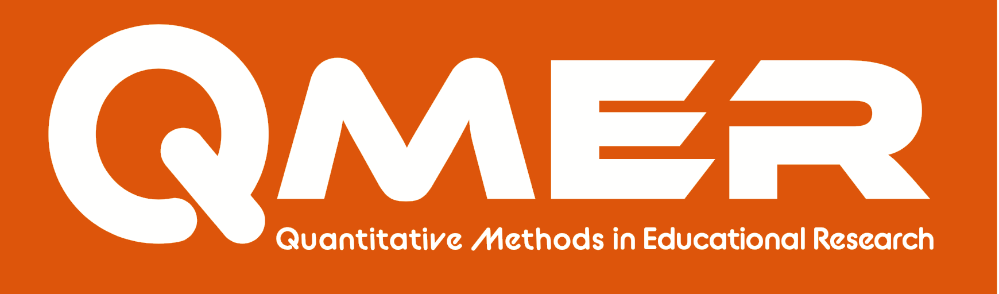

class: large
```{r, echo=FALSE, warning=FALSE, message=FALSE}
library(knitr)
library(mosaic)
library(Lock5Data)
#source(file = "code/simulateHeights.R")
opts_chunk$set(echo = FALSE, comment = NULL)
library(supernova)
library(DiagrammeR)
library(psych)
library(png)
```
## Overview

This introduction to the plain-text workflow is aimed at achieving three goals.

* First, to describe why programming languages are becoming so important in research and what advantages they offer of other statistical software.  

* Second, overview what a **plain-text workflow** looks like

* Third, show you what such a workflow would look like in R

---
class: big1
```{r, out.width="50%"}

```

* Learning community for graduate students and faculty who want to improve their research and professional skills

* Safe, inclusive, environment developed to foster researcher development, through workshops, collaboration, and networking.

* We host workshops, trainings, and social events to promote a vibrant research community across Auburn's campus and community

* Offer opportunities for students to acquire skills beyond courses,  take leadership and roles.

* To learn more go to : https://aub.ie/qmer
---
class: inverse center middle

## Why are programming languages becoming popular for data analysis?

---
class: large
## At Least 3 Reasons Programming Language are Prevalent Today in Research

1. Growing emphasis on **Reproducible Research**

2. Growing need for **Computational Research Methods**

3. Growing availability and dependence on **Big Data**

---
class: large
## Reproducible Research Efforts

* Replication Crisis
    + Over-reliance on hypothesis testing
    + Researcher degrees of freedom
    + Small sample/under-powered studies

* Lead to emphasis on **Research Transparency**
    + Thorough documentation of processes and decisions
    + access to data
    + access to software procedures/details (i.e. code scripts)
    + researcher accountability
    
---
class: big1
## FAIR Principles

* **Findable** - The first step in (re)using data is to find them. Metadata and data should be easy to find for both humans and computers. Machine-readable metadata are essential for automatic discovery of datasets and services.

* **Accessible** - Once the user finds the required data, she/he/they need to know how they can be accessed, possibly including authentication and authorization.

* **Interoperable** - The data usually need to be integrated with other data. In addition, the data need to interoperate with applications or workflows for analysis, storage, and processing.

* **Reusable** - The ultimate goal of FAIR is to optimize the reuse of data. To achieve this, metadata and data should be well-described so that they can be replicated and/or combined in different settings.

Learn more at: https://www.go-fair.org/

---
class: big2
## Computational Science

           "Computational principles and tools will become integrated into science,
           changing the fundamental way that science is practiced" 
                               -  Toward Science 2020 (Microsoft Research, 2006)
           
* Computational Science - "... using advanced computing capabilities to understand and solve complex problems." (wikipedia). 
    + Computational Biology (Corona virus technology)
    + Weather prediction models 
    + Global warming models
    + Many other examples in physics, medicine, chemistry, etc)

* Computational Social Science (Very New)
    + Many (most?, all?) social issues we face are complex
    + Why not address complex social issues with these tools?

---
class: large
## Big Data 

>     "We are drowning in information but starved for knowledge" 
>                                                            - John Naisbitt

* We are inundated with data (information)
* We now have the computational **tools** to process these data
* We now have complex **methods** to analyze these data
* We **need** more researchers who can use these tools and methods to generate **knowledge**.


--
This requires us to rethink how we conduct (and teach researchers to conduct) research: Hence, **The plain-text workflow**

---
class: inverse center middle

## What does a plain-text workflow entail?

---
class: large
## In an Nutshell

The plain-text workflow:

--
* Stores information in **plain-text data file** (`.csv`,`.txt`, `.dat`, etc.)

--
* Processes this data in an programming language using **plain-text scripts**

---
class: large
## Characteristics of the Plain-Text Workflow


1. **Transparency** - Everything is well documented (code scripts) and accessible (e.g. plain-text and preferably open-source)

2. **Flexibility** - Workflow must be adaptable to novel projects (Not everything fits into a menu) and reusable within and across projects (We may need to do the same thing in different places in our project -- modular)

3. **Consistency** - At the same time the workflow should be consistent across projects and research labs.

4. **Efficiency** - Workflow should minimize wasting of time. 

---
class: large
## Principles of Coding

1. Document Everything - The time spent, will pay for itself in the long run.
2. **DRY**/**WET** - live the mantra "**D**on't **R**epeat **Y**ourself" or you will have to "**W**rite **E**verything **T**wice".
3. Modularity - Code scripts do one thing, but can often be used in multiple aspects of project
4. Version Control - Be able to revert to prior versions of project and be able to branch new ideas
5. Sourcing - Call one script, function,  or data file from another script. A good way to reuse code.

---
class: Large
## Resources

QMER Website: https://aub.ie/qmer

R based QMER website:  https://statistical-thinking.com