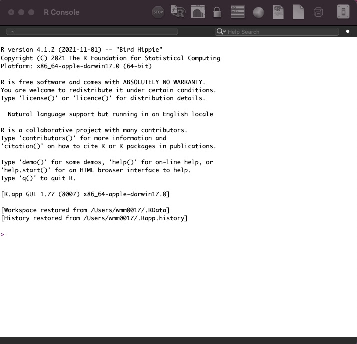
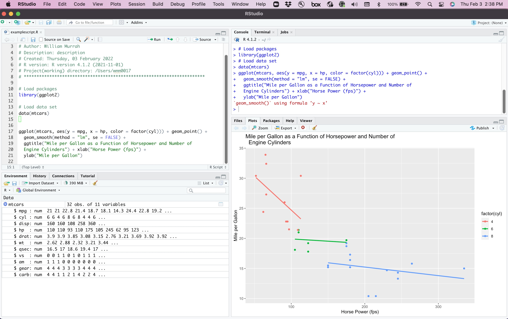

```{r, echo=FALSE, warning=FALSE, message=FALSE}
library(knitr)
library(mosaic)
library(Lock5Data)
#source(file = "code/simulateHeights.R")
opts_chunk$set(echo = FALSE, comment = NULL)
library(supernova)
library(DiagrammeR)
library(psych)
library(png)
```
class: big1
## Overview

This introduction to the R statistical programming language is aimed at achieving three goals.

* First, to describe why programming languages are becoming so important in research and what advantages they offer of other statistical software.  

* Second,to introduce those considering R as a platform for research and statistics. 

* Third, to demonstrate why R is a great language to start to learn basic programming skills for applied researchers.

* Fourth, point you to resources that can help you learn R and/or learn more about R.


---
class: inverse center middle

## Why are programming languages becoming popular for data analysis?


---
class: large
## Reproducible Research Efforts

* Replication Crisis
    + Over-reliance on hypothesis testing
    + Researcher degrees of freedom
    + Small sample/under-powered studies

* Lead to emphasis on **Research Transparency**
    + Thorough documentation of processes and decisions
    + access to data
    + access to software procedures/details (i.e. code scripts)
    + researcher accountability
    
---
class: big1
## FAIR Principles

* **Findable** - The first step in (re)using data is to find them. Metadata and data should be easy to find for both humans and computers. Machine-readable metadata are essential for automatic discovery of datasets and services.

* **Accessible** - Once the user finds the required data, she/he/they need to know how they can be accessed, possibly including authentication and authorization.

* **Interoperable** - The data usually need to be integrated with other data. In addition, the data need to interoperate with applications or workflows for analysis, storage, and processing.

* **Reusable** - The ultimate goal of FAIR is to optimize the reuse of data. To achieve this, metadata and data should be well-described so that they can be replicated and/or combined in different settings.

Learn more at: https://www.go-fair.org/

---
class: big2
## Computational Science

           "Computational principles and tools will become integrated into science,
           changing the fundamental way that science is practiced" 
                               -  Toward Science 2020 (Microsoft Research, 2006)
           
* Computational Science - "... using advanced computing capabilities to understand and solve complex problems." (wikipedia). 
    + Computational Biology (Corona virus technology)
    + Weather prediction models 
    + Global warming models
    + Many other examples in physics, medicine, chemistry, etc)

* Computational Social Science (Very New)
    + Many (most?, all?) social issues we face are complex
    + Why not address complex social issues with these tools?

---
class: inverse center middle

## What would a code-based/plain-text workflow entail?


---
class: large
## Code-based/Plain-text Workflow Goals

1. Flexibility

2. Efficiency

3. Transparency
           

---
## Anatomy of a Code Script


---
class: inverse center middle

## What makes R a good programming language for data analysis?


---
class: big1
## What is R?

* "R is a free software environment for statistical computing and graphics. It compiles and runs on a wide variety of UNIX platforms, Windows and MacOS" - r-project.org

* R is an integrated suite of software facilities for data manipulation, calculation and graphical display. It includes:
    + an effective data handling and storage facility,
    + a suite of operators for calculations on arrays, in particular matrices,
    + a large, coherent, integrated collection of intermediate tools for data analysis,
    + graphical facilities for data analysis and display either on-screen or on hardcopy, and
    + a well-developed, simple and effective programming language which includes conditionals, loops, user-defined recursive functions and input and output facilities.
    
---
class: big1
## R is an implementation of the S programming language

* S was created around 1976 at Bell Labs
* R was first implemented from S in 1991 by statisticians Ross Ihaka and Robert Gentleman at the University of Auckland, New Zealand.
* In 1995, statistician Martin Machler convinced Ihaka and Gentleman to make R a free and open-source software under the GNU General Public License.
* The Comprehensive R Archive Network (CRAN) was officially announced on 23 April 1997.


---

.pull-left[

* R app
]

.pull-right[


```{r, out.height="150%"}

```
]


---
class: inverse
```{r, out.width="120%"}

```


---
class: big1
## R is a Powerful Statistical Programming Language

* R was created by statisticians for statistics
* R has exceptional graphics
* R has over 18,000 user create packages.

